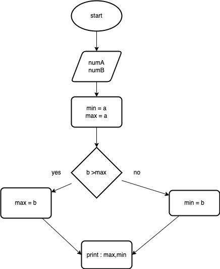
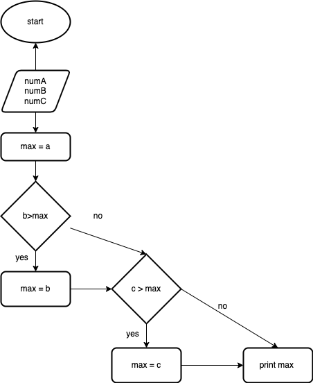
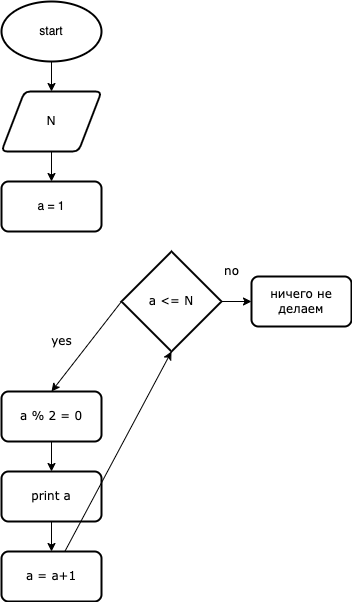

## Задача 1
Напишите программу, которая на вход принимает два числа и выдаёт, какое число большее, а какое меньшее.
 | [Код](hw1/Program.cs)

## Задача2 
Напишите программу, которая принимает на вход три числа и выдаёт максимальное из этих чисел.
 | [Код](hw2/Program.cs)

## Задача 3
Напишите программу, которая на вход принимает число и выдаёт, является ли число чётным (делится ли оно на два без остатка).
 | [Код](hw3/Program.cs)

## Задача 4
Напишите программу, которая на вход принимает число (N), а на выходе показывает все чётные числа от 1 до N.
[Код](hw4/Program.cs)

